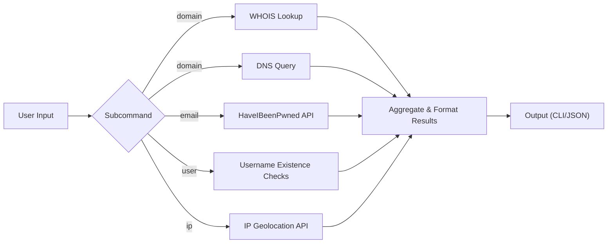

# osint-cli

A modular Python CLI for lightweight OSINT (Open-Source Intelligence) workflows. The tool ships with focused subcommands for:

- `domain`: WHOIS and DNS lookups
- `email`: HaveIBeenPwned breach checks
- `user`: username presence checks on common platforms
- `ip`: IP geolocation and ASN/ISP lookup

The project keeps API keys in environment variables, supports human-readable and JSON output, and includes pytest coverage plus a GitHub Actions CI workflow.

## Features

- Pure-Python WHOIS lookups using `python-whois`
- DNS resolution using `dnspython`
- HaveIBeenPwned account breach checks using `pyhibp`
- Direct HIBP HTTP fallback if `pyhibp` breaks or is unavailable
- Username presence checks powered by `requests`
- Parallel username checks with optional per-service filtering
- IP geolocation through the IPinfo API
- Local-only classification for private, loopback, reserved, and link-local IPs
- `--json` output mode for automation or piping into other tools
- Consistent metadata on every JSON response: `ok`, `generated_at`, `sources`, and `summary`
- `--no-color` support for clean non-TTY or log-friendly output
- Cross-platform packaging with a console entrypoint: `osint-cli`

## Architecture



## Installation

1. Install Python 3.11 or newer.
2. Install dependencies:

```bash
python -m pip install -r requirements.txt
```

3. Install the CLI entrypoint:

```bash
python -m pip install .
```

You can also run the tool directly during development:

```bash
python main.py --help
```

## Kali Linux Quick Start

Kali often enforces PEP 668 "externally managed" Python environments, so the safest and least frustrating way to run this project is inside a virtual environment.

Fast path:

```bash
sudo apt update
sudo apt install -y python3 python3-venv python3-pip git
./scripts/setup-kali.sh
source .venv/bin/activate
```

Manual path:

```bash
python3 -m venv .venv
source .venv/bin/activate
python -m pip install --upgrade pip
python -m pip install -r requirements.txt
python -m pip install -e .
```

Make-based path:

```bash
make kali
source .venv/bin/activate
```

Why this matters on Kali:

- it avoids breaking system Python packages
- it works cleanly with Kali's package-management protections
- it gives you an `osint-cli` command in the virtual environment
- it keeps API-client dependencies isolated from the rest of the system

## API Keys

Create environment variables before running API-backed commands:

```bash
export HIBP_API_KEY="your_hibp_api_key"
export IPINFO_TOKEN="your_optional_ipinfo_token"
export OSINT_CLI_USER_AGENT="osint-cli/0.1.0 (security-team@example.com)"
```

PowerShell example:

```powershell
$env:HIBP_API_KEY = "your_hibp_api_key"
$env:IPINFO_TOKEN = "your_optional_ipinfo_token"
$env:OSINT_CLI_USER_AGENT = "osint-cli/0.1.0 (security-team@example.com)"
```

Notes:

- `HIBP_API_KEY` is required for the `email` subcommand.
- `IPINFO_TOKEN` is optional, but recommended to avoid tighter anonymous rate limits.
- `OSINT_CLI_USER_AGENT` lets you override the default HIBP user-agent string.

## Usage

General form:

```bash
osint-cli [--json] [--timeout 10] [--no-color] <command> <query>
```

You can also run the package without installing the console script:

```bash
python -m osint --help
```

### Domain WHOIS + DNS

```bash
osint-cli domain example.com
osint-cli domain example.com --json
```

### Email breach check

```bash
osint-cli email alice@example.com
osint-cli email alice@example.com --json
```

### Username checks

```bash
osint-cli user johndoe
osint-cli user johndoe --timeout 5 --json
osint-cli user johndoe --services github,gitlab
```

### IP geolocation

```bash
osint-cli ip 8.8.8.8
osint-cli ip 203.0.113.45 --json
osint-cli ip 192.168.1.5 --json
```

## Why Use Each Command

### `domain`

Use this when you need quick infrastructure context on a domain.

Why it is useful:

- identifies registrar and key lifecycle dates
- reveals basic DNS footprint such as mail handling and authoritative nameservers
- helps with recon, incident scoping, phishing investigations, and asset triage

### `email`

Use this when validating whether an email address has appeared in public breach data.

Why it is useful:

- helps estimate credential exposure risk
- supports incident response and password-reset prioritization
- gives breach names and exposed data classes without dumping sensitive raw datasets

### `user`

Use this when correlating a handle across common public platforms.

Why it is useful:

- quickly tests whether a username appears reused
- supports profiling, attribution leads, and account-enumeration research
- lets you limit checks to only the services you care about with `--services`

### `ip`

Use this when you need quick geolocation and network-owner context.

Why it is useful:

- identifies likely country, region, and city
- extracts ASN and ISP ownership clues
- safely classifies non-public IPs locally instead of sending internal addresses to an external API

## Operational Notes

- `--json` is best for automation, piping into `jq`, or saving structured output.
- `--timeout` is useful when a target or service is slow.
- `--no-color` keeps logs and redirected output clean.
- `user --services` accepts comma-separated slugs such as `github,gitlab,reddit,x`.
- `user --services twitter` also works and maps to `x`.

## Example JSON Output

```json
{
  "ok": true,
  "command": "domain",
  "query": "example.com",
  "generated_at": "2026-04-01T08:52:18Z",
  "sources": [
    "python-whois",
    "dnspython"
  ],
  "whois": {
    "registrar": "Example Registrar Inc.",
    "creation_date": "1995-08-13",
    "updated_date": "2024-08-12",
    "expiration_date": "2025-08-12",
    "nameservers": [
      "ns1.example.com",
      "ns2.example.com"
    ],
    "status": [
      "clientTransferProhibited"
    ]
  },
  "dns": {
    "A": [
      "93.184.216.34"
    ],
    "AAAA": [],
    "MX": [
      "10 mail.example.com."
    ],
    "NS": [
      "ns1.example.com",
      "ns2.example.com"
    ],
    "TXT": [],
    "CNAME": [],
    "SOA": []
  },
  "summary": {
    "whois_available": true,
    "dns_record_types_with_answers": 3,
    "dns_records_found": 5
  }
}
```

Every successful JSON response includes:

- `ok`
- `command`
- `query`
- `generated_at`
- `sources`
- command-specific fields
- `summary`

Errors are also structured in JSON mode and include:

- `ok: false`
- `error`
- `generated_at`
- the command and query when available

## Commands

### `domain <name>`

Performs:

- WHOIS lookup
- DNS record collection for `A`, `AAAA`, `MX`, `NS`, `TXT`, and `CNAME`

Typical fields:

- registrar
- creation, update, and expiration dates
- nameservers
- DNS record values

### `email <address>`

Performs:

- HaveIBeenPwned account breach lookup

Typical fields:

- breach name
- breach date
- source domain
- verification status
- exposed data classes

### `user <username>`

Performs:

- lightweight HTTP-based presence checks against GitHub, GitLab, Reddit, Keybase, and X
- parallel checks for faster turnaround
- optional `--services` filtering for targeted lookups

Typical fields:

- service name
- profile URL checked
- whether the username appears present, absent, or unknown

### `ip <address>`

Performs:

- IPinfo geolocation lookup
- local classification only for non-global IPs to avoid leaking internal addresses

Typical fields:

- classification
- IP version
- reverse PTR name
- hostname
- city, region, country
- timezone
- ASN
- ISP / network owner

## Testing

Run the unit test suite:

```bash
python -m pytest
```

Run lint checks:

```bash
python -m flake8 osint utils tests main.py
```

The tests rely on dependency injection and mocked responses rather than live network calls. That keeps the suite deterministic and avoids leaking real query data during CI runs.

Useful project shortcuts:

```bash
make install
make test
make lint
```

## Privacy and Security Notes

- The CLI does not persist query data to disk.
- API keys are only read from environment variables.
- Human-readable email output masks the local-part of the address.
- Private, loopback, reserved, link-local, and other non-global IPs are classified locally and are not sent to IPinfo.
- Username checks are heuristic HTTP probes and can be affected by anti-bot protections or service redesigns.

## Limitations

- `pyhibp` is an older dependency, so the email subcommand uses a defensive direct-HTTP fallback if needed.
- Anonymous IPinfo access is rate-limited.
- Some websites may return ambiguous responses for username checks, which are surfaced as `unknown` instead of forcing a false positive.
- WHOIS data quality varies by registrar and TLD.

## Safe Configuration Checklist

- Keep API keys in shell environment variables, not in source files.
- Do not commit `.env` files with real secrets.
- Prefer `--json` when feeding the output into other tools or scripts.
- Treat username checks as heuristics, not proof of identity.
- Use a dedicated virtual environment on Kali and other Debian-based systems.
